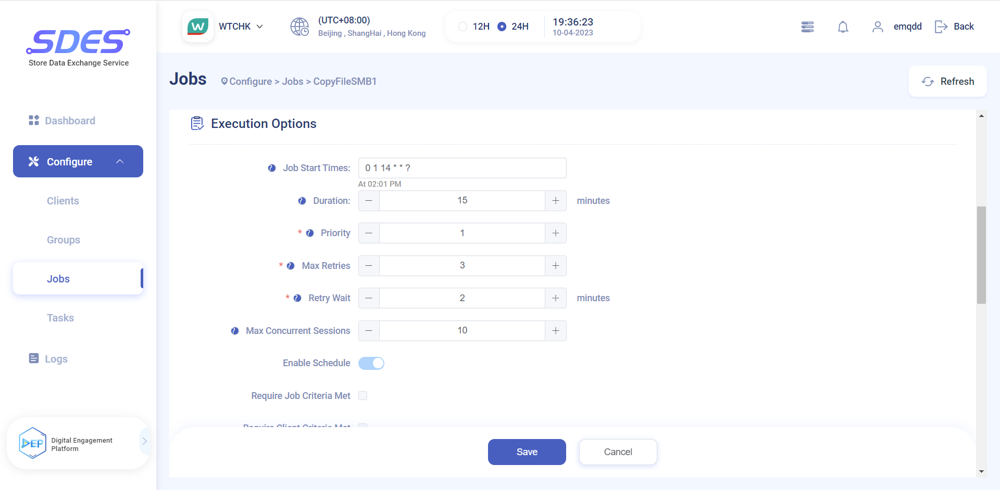
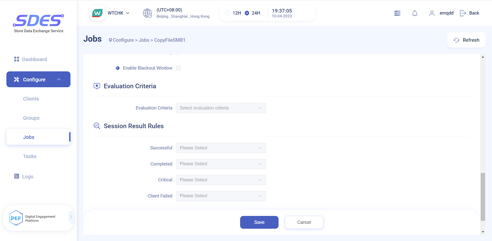

# EMQX & Watsons SDES Jobs

## Job - Task - Script 关系
## 如何创建 Job
在 SDES Dashboard 点击添加 Job

然后需要配置`Job Start Times` `Priority` `Max Retries` `Retry Wait `等一些关键信息。

## 如何设置 Job 的执行时间

### crontab 简介
crontab 是一个用于在 Linux 和类 Unix 操作系统上自动执行命令或脚本的工具。它允许用户按照预定义的时间表安排任务，例如每天、每周或每月运行一次。 crontab 命令用于创建、编辑和删除这些计划任务。
时间格式如下：
~~~shell
f1 f2 f3 f4 f5 ?
~~~
- 其中 f1 是表示分钟，f2 表示小时，f3 表示一个月份中的第几日，f4 表示月份，f5 表示一个星期中的第几天。
- 当 f1 为 * 时表示每分钟都要执行，f2 为 * 时表示每小时都要执行程序，其余类推。
- 当 f1 为 a-b 时表示从第 a 分钟到第 b 分钟这段时间内要执行，f2 为 a-b 时表示从第 a 到第 b 小时都要执行，其余类推。
- 当 f1 为 */n 时表示每 n 分钟个时间间隔执行一次，f2 为 */n 表示每 n 小时个时间间隔执行一次，其余类推。
- 当 f1 为 a, b, c,... 时表示第 a, b, c,... 分钟要执行，f2 为 a, b, c,... 时表示第 a, b, c...个小时要执行，其余类推。
~~~shell
*    *    *    *    *
-    -    -    -    -
|    |    |    |    |
|    |    |    |    +----- 星期中星期几 (0 - 6) (星期天 为0)
|    |    |    +---------- 月份 (1 - 12) 
|    |    +--------------- 一个月中的第几天 (1 - 31)
|    +-------------------- 小时 (0 - 23)
+------------------------- 分钟 (0 - 59)
~~~
下面是一些常见的crontab。
| 执行时间                | 格式      |
| --------------------- | --------- |
| 每小时定时执行一次       | 0 * * * * |
| 每天定时执行一次         | 0 0 * * * |
| 每周定时执行一次         | 0 0 * * 0 |
| 每月定时执行一次         | 0 0 1 * * |
| 每月最后一天定时执行一次  | 0 0 L * * |
| 每年定时执行一次         | 0 0 1 1 * |       
## Job 如何绑定 Task & Clients
在 Task 添加成功之后，可以选择添加 Job

配置完成 Job 后，添加并配置 Task，Task 添加成功后选择添加job,选择刚才的创建好的 Job。

